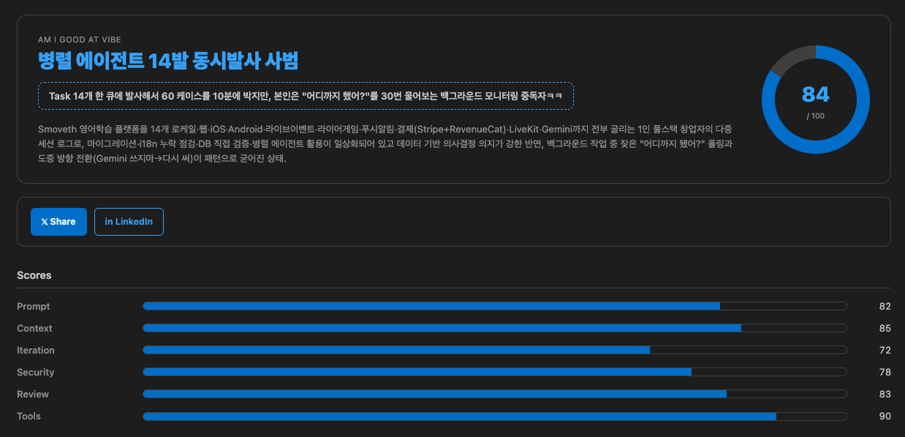

<sub>🌐 <a href="https://github.com/mykim-aus/AM-I-GOOD-AT-VIBE/blob/main/README.md">🇺🇸 English README</a></sub>

# 🧠 AM I GOOD AT VIBE

> **터미널 AI CLI 대화와 IDE 채팅 패널 히스토리까지 모두 로컬에서만 캡쳐해서, 당신의 코딩 바이브를 정리해 까주는 VS Code 익스텐션.**

<p align="center">
  
</p>

AM I GOOD AT VIBE 는 (1) VS Code 통합 터미널의 **AI CLI 대화** (Claude Code, Codex, Gemini CLI, aider, Copilot CLI — 실시간 캡쳐) 와 (2) **IDE 채팅 패널 히스토리** (Claude Code IDE, GitHub Copilot Chat, VS Code 채팅 패널, Cursor — 각 도구가 디스크에 남기는 세션 스토어를 직접 읽음), 그리고 코드 변경 내역과 프롬프트 입력을 모두 조용히 기록합니다. 그 로그를 **본인 컴퓨터에서 도는 로컬 AI CLI** 에 넘겨서, SNS 에 그대로 박제할 수 있는 한 줄짜리 분석 리포트를 뽑아줍니다 — 닉네임, 매운맛 한 줄 평, 6개 역량 점수, 그리고 실제로 5분 안에 할 수 있는 액션 아이템까지.

**100% 로컬. 소스 코드는 절대 외부로 안 나갑니다.** ([캡쳐 경로 직접 확인 →](src/extension.ts) · [마스킹 정규식 직접 확인 →](src/util.ts))

---

## ⚠️ 베타 (v0.1.0) — 테스터 구함

이건 **첫 공개 릴리즈**입니다. 저(저자) 혼자 한 환경에서만 돌려봤습니다.

| 테스트 환경 | 상태 |
|---|---|
| macOS + VS Code 1.93+ + Claude Code v0.1 | ✅ 동작 확인 |
| Windows | ❓ 미검증 (SQLite 기반 채팅 캐시 import 는 의도적으로 Windows 에서 비활성화. 터미널 캡쳐는 동작할 가능성 높음) |
| Linux | ❓ 미검증 |
| Codex / Gemini / aider / Copilot / Cody / Cursor CLI | ❓ 패턴 매칭은 있지만 end-to-end 테스트는 못 함 |
| Cursor IDE | ❓ 채팅 캐시 경로는 정의돼 있지만 미검증 |

**굴려보셨다면 [issue 한 줄 남겨주시면](https://github.com/mykim-aus/AM-I-GOOD-AT-VIBE/issues) 진짜 도움이 됩니다** — "macOS, Claude Code, 캡쳐 됨 ✅" 한 줄도 충분히 가치 있어요. 크로스 플랫폼 PR 도 환영합니다([Contributing](#-contributing) 섹션 참고).

---

## ✨ 주요 기능

| # | 기능 | 설명 |
|---|---|---|
| 1 | **터미널 AI CLI 캡쳐** | `claude`, `codex`, `gemini`, `aider`, `q chat`, `gh copilot`, `cody`, `cursor-agent` 자동 인식 |
| 2 | **IDE 채팅 패널 히스토리 import** | Claude Code IDE (`~/.claude/projects/<workspace>/*.jsonl`), VS Code 채팅 패널 (`chatSessions/`), GitHub Copilot Chat (`state.vscdb`), Cursor (`state.vscdb`) 의 디스크 세션 스토어를 직접 읽음 — proposed API 불필요, Analyze 누를 때마다 갱신 |
| 3 | **인터랙티브 REPL 추적** | `❯` (사용자 턴) / `⏺` (어시스턴트 턴) 단위로 줄 별 실시간 파싱 |
| 4 | **자체 채팅 참여자** | `@amigoodatvibe` chat participant 로 GUI 쪽 프롬프트 기록 |
| 5 | **🔒 100% Capture Terminal** | Shell Integration 없이도 모든 키 입력을 캡쳐하는 옵트인 유사 터미널 |
| 6 | **실시간 시크릿 마스킹** | API 키 (Anthropic / OpenAI / Gemini / GitHub / AWS), JWT, Bearer 토큰, 비밀번호, `.env` 라인 → `[MASKED_*]` 로 치환된 뒤에만 디스크 기록 |
| 7 | **사이드바 UI** | 메인 CTA + 라이브 통계 + 최근 활동 피드 (캡쳐 이벤트에 맞춰 자동 새로고침) |
| 8 | **바이브 리포트 웹뷰** | 닉네임 / 한 줄 평 / 6개 역량 점수 막대 / 강점·개선점 / 액션 아이템 / X·LinkedIn 공유 버튼 |
| 9 | **언어 적응형 분석** | 로그가 한국어 위주면 한국어, 영어 위주면 영어로 닉네임·로스트를 출력 (그 외 언어는 영어로 폴백) |
| 10 | **VS Code 테마 호환** | 모든 색상이 `var(--vscode-*)` 토큰 — 다크/라이트 자동 전환 |

---

## 🚀 설치

### VS Code 마켓플레이스에서 (권장)

VS Code 확장(Extensions) 뷰에서 **"AM I GOOD AT VIBE"** 검색하시거나, 아래 링크로 바로 설치:
👉 https://marketplace.visualstudio.com/items?itemName=amigoodatvibe.amigoodatvibe

### 소스에서 직접 (개발용)

```bash
git clone https://github.com/mykim-aus/AM-I-GOOD-AT-VIBE.git
cd AM-I-GOOD-AT-VIBE
npm install
npm run compile
# VS Code 에서 이 폴더 열고 → F5 누르면 Extension Development Host 가 뜸
```

### 첫 실행

새 창의 통합 터미널에서 아무 AI CLI 나 한 번 굴려보세요:

```bash
claude "write me a hello world function"
```

`<workspace>/.am-i-good-at-vibe/raw_history.json` 캡쳐 파일이 생깁니다. 그 다음 액티비티 바의 **AM I GOOD AT VIBE** 아이콘 클릭 → **📊 Analyze** 누르면 분석이 돌아요. 또는 명령 팔레트에서 `AM I GOOD AT VIBE: 🧠 Analyze My AI Coding Vibe`.

> 분석은 본인 컴퓨터의 로컬 AI CLI (`claude` 기본값) 에 위임합니다. **외부 서버로 전송되는 데이터는 없습니다.**

### 요구 사항

- **VS Code 1.93+** (Shell Integration 기본 활성화 — 가장 정확한 캡쳐 경로에 필요)
- **로컬 AI CLI** — 기본은 `claude`. `amigoodatvibe.localCliTool` 설정으로 `codex`, `gemini` 등으로 바꿀 수 있음
- **macOS 권장.** Copilot / Cursor 등 IDE 의 SQLite 채팅 캐시 import 는 Windows 에선 no-op (시스템 `sqlite3` 의존). 터미널 캡쳐 자체는 크로스 플랫폼이지만 아직 검증 안 됨

---

## 🔒 프라이버시 & 한계

- **로컬 저장만**: 모든 로그 라인은 `<workspace>/.am-i-good-at-vibe/raw_history.json` 에만 들어가고, 해당 폴더는 자동으로 `.gitignore` 처리됨.
- **메모리 단계 마스킹**: 정규식 마스킹이 *디스크에 쓰기 전*에 동작. API 키 / 비밀번호 / `.env` 라인은 평문 그대로 디스크에 닿지 않음.
- **다른 익스텐션의 GUI 채팅은 실시간으로 가로채지 못함**: VS Code 가 다른 익스텐션의 웹뷰 채팅을 읽을 수 있는 공식 API 를 제공하지 않습니다. 우회로 **Analyze** 를 누를 때 Copilot / Cursor 의 디스크 SQLite 와 Claude Code 의 세션 JSONL 을 한 번에 긁어옵니다.
- **Shell Integration 권장**: 정밀한 터미널 응답 캡쳐를 위해 VS Code 1.93+ Shell Integration 이 필요 (기본 활성화).
- **외부 터미널 (Terminal.app / iTerm) 은 캡쳐 안 됨**: VS Code 프로세스 트리 밖이라 접근 불가. 통합 터미널을 쓰시거나, Shell Integration 이 안 되는 환경이면 옵트인 **🔒 100% Capture Terminal** 프로파일을 사용하세요.

---

## ⚙️ 설정

| 키 | 기본값 | 설명 |
|---|---|---|
| `amigoodatvibe.localCliTool` | `claude` | 바이브 분석에 쓸 로컬 AI CLI |
| `amigoodatvibe.outputLanguage` | `auto` | `auto` / `english` / `korean` — 닉네임·로스트 언어를 강제 (EN/KO 만 지원, 그 외는 영어로 폴백) |
| `amigoodatvibe.autoCapture` | `true` | 백그라운드 자동 캡쳐 켜고/끄기 |
| `amigoodatvibe.maskingEnabled` | `true` | 실시간 시크릿 마스킹 켜고/끄기 |
| `amigoodatvibe.cliTimeoutMs` | `120000` | 분석 CLI 실행 타임아웃 (ms) |
| `amigoodatvibe.captureCodeChanges` | `true` | 코드 변경 메타데이터 캡쳐 여부 |
| `amigoodatvibe.logRotateBytes` | `1048576` | 로그 회전 임계 크기 (bytes) |

---

## 🧩 지원 AI CLI

| 도구 | 명령 패턴 예시 | 검증? |
|---|---|---|
| Claude Code | `claude "..."`, `claude -p "..."`, `claude` (REPL) | ✅ |
| OpenAI Codex CLI | `codex chat "..."`, `codex exec "..."` | ❓ |
| Google Gemini CLI | `gemini chat "..."`, `gemini "..."` | ❓ |
| aider | `aider --message "..."` | ❓ |
| Amazon Q | `q chat "..."` | ❓ |
| GitHub Copilot CLI | `gh copilot suggest "..."`, `gh copilot explain "..."` | ❓ |
| Sourcegraph Cody | `cody chat "..."` | ❓ |
| Cursor Agent | `cursor-agent "..."` | ❓ |

새 도구 추가는 보통 [src/util.ts](src/util.ts) 의 `AI_CLI_PATTERNS` 에 한 줄 추가로 끝납니다.

---

## 🛠 트러블슈팅

**사이드바에 활동이 안 떠요**

1. 명령 팔레트에서 `AM I GOOD AT VIBE: 🩺 Run Capture Diagnostics` 실행. **Shell Integration** 이 `ON` 으로 나오는지 확인.
2. VS Code **내장 통합 터미널**을 쓰고 있는지 확인. 외부 터미널(Terminal.app, iTerm, Warp)은 VS Code 가 못 봅니다.
3. 터미널 프롬프트 옆에 작은 점이 있으면 Shell Integration 활성화 상태. 없으면 설정에서 `terminal.integrated.shellIntegration.enabled: true`.
4. 그래도 안 되면 **+ New Terminal** 드롭다운에서 **AM I GOOD AT VIBE Capture** 프로파일을 선택. Shell Integration 없이도 stdio 100% 캡쳐가 됩니다.

**"Local CLI not found" 에러**

`amigoodatvibe.localCliTool` 설정값(기본 `claude`) 이 VS Code 가 띄운 쉘의 `$PATH` 에서 잡혀야 합니다. VS Code 통합 터미널에서 `which claude` (또는 본인이 설정한 CLI) 로 확인.

**Analyze 했는데 Claude Code 히스토리가 안 따라와요**

익스텐션이 `~/.claude/projects/<workspace-hash>/*.jsonl` 을 읽습니다. Claude Code 가 설치돼 있어도 이 워크스페이스에서 한 번도 안 굴렸으면 해당 디렉터리가 없을 수 있어요 — 다음 `claude` 실행부터 캡쳐가 시작됩니다. 그 사이에 캡쳐된 분량만 가지고도 분석은 돌아갑니다.

**Analyze 가 "could not find a JSON object" 라고 떠요**

로컬 CLI 가 순수 JSON 대신 산문을 뱉었다는 뜻. **View → Output → AM I GOOD AT VIBE** 에서 원본 CLI 응답을 확인하세요. 보통은 시스템 프롬프트가 잘렸거나, 모델이 JSON-only 지시를 무시하는 버전이라 그래요. 더 엄격한 CLI 플래그를 주거나 다른 모델로 바꿔보세요.

---

## 📐 분석 결과 스키마

로컬 CLI 는 다음 형태의 JSON 객체 하나를 반환해야 합니다:

```jsonc
{
  "nickname":       "프롬프트 한 줄 컷 사무라이",
  "one_line_pack":  "Claude 환각은 저격수처럼 잡아내면서, 본인 diff 는 안 읽는 듯.",
  "overall_score":  82,
  "summary":        "프롬프트 습관은 견고한데 보안 구멍 하나가 크게 보임.",
  "competency_scores": {
    "prompt_quality":       85,
    "context_setting":      72,
    "iteration_efficiency": 78,
    "security_awareness":   55,
    "code_review_habit":    88,
    "tool_diversity":       70
  },
  "strengths":    [{ "title": "...", "evidence": "..." }],
  "improvements": [{ "title": "...", "evidence": "...", "actionable": "..." }],
  "action_items": ["...", "..."],
  "recommended_next_actions": ["...", "..."]
}
```

> 🌐 **언어 적응**: `nickname`, `one_line_pack`, `summary`, 모든 evidence 문자열은 사용자 프롬프트의 다수 언어에 맞춰 영어 또는 한국어로 나옵니다. 로그가 비었거나 / 섞여있거나 / 그 외 언어이면 영어로 폴백.

전체 시스템 프롬프트는 [src/prompt.ts](src/prompt.ts) 에 있습니다.

---

## 🐞 알려진 한계

- **macOS 만 검증됨** — 위 베타 상태 표 참고.
- **Windows IDE 캐시 import 는 비활성화** — SQLite import 경로가 시스템 `sqlite3` CLI 를 셸 호출하는데 Windows 엔 기본 탑재가 안 돼 no-op 가 됩니다. 터미널 캡쳐는 영향 없음.
- **인터랙티브 REPL 은 Shell Integration 필요** — 없으면 REPL 턴별 파싱이 best-effort 라인 분류로 떨어집니다.
- **옵트인 100% Capture Terminal 은 진짜 PTY 가 아님** — 풀스크린 TUI 앱 (`claude` REPL 의 풀스크린 UI, vim 등) 은 제대로 렌더링 안 됩니다. 일회성 명령에 쓰세요.
- **외부 터미널 (Terminal.app, iTerm, Warp) 은 캡쳐 안 됨** — VS Code 프로세스 트리 밖.

---

## 🧪 테스트

```bash
npm test       # → 순수 헬퍼 + 프롬프트 빌더 + 익스텐션 캐시 리더에 대해 100 개 단위 테스트
```

`vscode` 모듈에 의존하지 않는 코드 전부 커버. UI / 웹뷰 / 캡쳐 변경은 Extension Development Host(F5) 에서 수동 재현이 필요합니다.

---

## 🤝 Contributing

이건 v0.1 릴리즈, 테스터 한 명(저, 한 머신) 짜리입니다. **도움이 절실한 영역:**

- 크로스 플랫폼 검증 (Windows, Linux) — 설치·실행·결과 issue 한 줄 부탁드립니다.
- Claude Code 외 CLI 의 end-to-end 테스트 (Codex, Gemini, aider, q chat, gh copilot, cody, cursor-agent).
- 새 AI CLI 추가 — 보통 [src/util.ts](src/util.ts) 의 `AI_CLI_PATTERNS` 에 한 줄 추가로 끝.
- **평가 항목 다듬기** — [src/prompt.ts](src/prompt.ts) 의 6개 역량 점수(`prompt_quality`, `context_setting`, `iteration_efficiency`, `security_awareness`, `code_review_habit`, `tool_diversity`) 의 추가·제거·가중치 제안 모두 환영합니다.
- **프롬프트 개선** — 분석 시스템 프롬프트는 [src/prompt.ts](src/prompt.ts) 에 있습니다. 더 날카로운 roast, JSON 출력 안정성, 언어 감지 개선 등 — 좋은 PR 소재입니다.
- [src/extension.ts](src/extension.ts) 와 캡쳐 경로 코드 리뷰 (처음 오픈소스로 푸는 코드라 신선한 눈이 정말 도움 됩니다).

전체 가이드 — 모든 PR 이 지켜야 할 **로컬 우선** 불변 조건 포함 — 은 [CONTRIBUTING.md](CONTRIBUTING.md) 참고.

---

## ⭐ 응원

AM I GOOD AT VIBE 로 한 번 웃으셨다면 GitHub 별 한 번 부탁드립니다. 이 프로젝트가 보는 유일한 신호입니다.
👉 [github.com/mykim-aus/AM-I-GOOD-AT-VIBE](https://github.com/mykim-aus/AM-I-GOOD-AT-VIBE)

---

## 📄 라이선스

MIT — [LICENSE](LICENSE) 참고.
