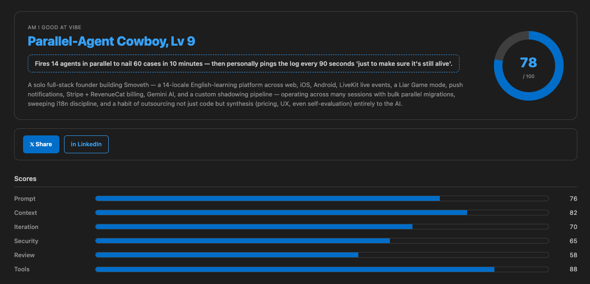

<sub>🌐 <a href="https://github.com/mykim-aus/AM-I-GOOD-AT-VIBE/blob/main/README.ko.md">🇰🇷 한국어 README</a></sub>

# 🧠 AM I GOOD AT VIBE

> **A local-first VS Code extension that captures your terminal AI CLI conversations and roasts your coding vibe.**

<p align="center">
  
</p>

AM I GOOD AT VIBE silently records every Claude Code / Codex / Gemini CLI / aider / Copilot CLI conversation you have in the integrated terminal, plus your code changes and prompt entries — then hands the log to your own local AI CLI to produce a witty, social-media-shareable analysis: a nickname, a spicy one-line roast, six competency scores, and concrete action items.

**100% local. Your source code never leaves your machine.** ([audit the capture path →](src/extension.ts) · [audit the masking regex →](src/util.ts))

---

## ⚠️ Beta status (v0.1.0) — testers wanted

This is the **first public release**. I (the author) have only been able to verify it on a single environment:

| Tested on | Status |
|---|---|
| macOS + VS Code 1.93+ + Claude Code v0.1 | ✅ Works |
| Windows | ❓ Unverified (SQLite chat-cache import is disabled on Windows by design; capture itself should still work) |
| Linux | ❓ Unverified |
| Codex / Gemini / aider / Copilot / Cody / Cursor CLIs | ❓ Pattern matching exists but not tested end-to-end |
| Cursor IDE | ❓ Chat-cache paths defined but unverified |

**If you try it, please [open an issue](https://github.com/mykim-aus/AM-I-GOOD-AT-VIBE/issues) with what worked and what didn't** — even a one-line "macOS, Claude Code, capture works ✅" is genuinely helpful. PRs for cross-platform fixes are especially welcome (see the [Contributing](#-contributing) section).

---

## ✨ Features

| # | Feature | Notes |
|---|---|---|
| 1 | **Terminal AI CLI capture** | Auto-detects `claude`, `codex`, `gemini`, `aider`, `q chat`, `gh copilot`, `cody`, `cursor-agent` |
| 2 | **Interactive REPL tracking** | Line-by-line real-time parsing of `❯` user turns and `⏺` assistant turns inside REPLs |
| 3 | **Own chat participant** | `@amigoodatvibe` chat participant for GUI-side prompt recording |
| 4 | **🔒 100% Capture Terminal** | Optional opt-in pseudoterminal that captures EVERY keystroke, no Shell Integration required |
| 5 | **Real-time secret masking** | API keys (Anthropic / OpenAI / Gemini / GitHub / AWS), JWT, Bearer, passwords, `.env` lines → `[MASKED_*]` before disk write |
| 6 | **Rich sidebar UI** | Main CTA + live stats + recent activity feed (auto-refreshes on capture) |
| 7 | **Vibe report webview** | Nickname / one-line roast / 6 competency bars / strengths · improvements / action items / X · LinkedIn share buttons |
| 8 | **Language-adaptive analysis** | Auto-detects English vs. Korean prompts and emits the nickname & roast in that language (anything else falls back to English) |
| 9 | **VS Code theme native** | All colors use `var(--vscode-*)` — dark/light auto-switches |

---

## 🚀 Install

**The marketplace listing isn't live yet.** Until then:

### From a release `.vsix`

1. Download `amigoodatvibe-X.Y.Z.vsix` from the [Releases page](https://github.com/mykim-aus/AM-I-GOOD-AT-VIBE/releases).
2. In VS Code: `Extensions: Install from VSIX…`

### From source

```bash
git clone https://github.com/mykim-aus/AM-I-GOOD-AT-VIBE.git
cd AM-I-GOOD-AT-VIBE
npm install
npm run compile
# Open this folder in VS Code → F5 to launch an Extension Development Host
```

### First run

In the integrated terminal of the new window, run any AI CLI:

```bash
claude "write me a hello world function"
```

The capture file `<workspace>/.am-i-good-at-vibe/raw_history.json` is created. Then click the **AM I GOOD AT VIBE** icon in the activity bar → **📊 Analyze**, or run `AM I GOOD AT VIBE: 🧠 Analyze My AI Coding Vibe` from the command palette.

> Analysis is delegated to your local AI CLI (`claude` by default). **No data is transmitted to any remote server.**

### Requirements

- **VS Code 1.93+** (Shell Integration is on by default; required for the most accurate capture path).
- **A local AI CLI** — defaults to `claude`. Configurable via `amigoodatvibe.localCliTool` (e.g. `codex`, `gemini`).
- **macOS recommended.** The SQLite-based IDE chat-cache importer (Copilot / Cursor) is a no-op on Windows; terminal capture should still work cross-platform but isn't verified yet.

---

## 🔒 Privacy & limits

- **Local storage only**: every log line lives at `<workspace>/.am-i-good-at-vibe/raw_history.json` and the directory is auto-`.gitignore`d.
- **Memory-level masking**: regex-based masking runs *before* the disk write — API keys / passwords / `.env` lines never touch disk in plaintext.
- **Other extensions' GUI chats can't be intercepted live**: VS Code provides no public API to read other extensions' webview chat panels. We work around this by reading their on-disk SQLite stores (Copilot, Cursor) and Claude Code's session JSONL files when you run **Analyze**.
- **Shell Integration recommended**: precise terminal response capture requires VS Code 1.93+ Shell Integration (enabled by default).
- **External terminals (Terminal.app / iTerm) aren't captured**: they're outside VS Code's process tree. Use the integrated terminal — or the opt-in **🔒 100% Capture Terminal** for cases where Shell Integration is unavailable.

---

## ⚙️ Configuration

| Key | Default | Description |
|---|---|---|
| `amigoodatvibe.localCliTool` | `claude` | Local AI CLI used for vibe analysis |
| `amigoodatvibe.outputLanguage` | `auto` | `auto` / `english` / `korean` — forces nickname/roast language (only EN & KO are supported; everything else falls back to English) |
| `amigoodatvibe.autoCapture` | `true` | Background auto-capture on/off |
| `amigoodatvibe.maskingEnabled` | `true` | Real-time secret masking on/off |
| `amigoodatvibe.cliTimeoutMs` | `120000` | Analysis CLI execution timeout (ms) |
| `amigoodatvibe.captureCodeChanges` | `true` | Capture code-change metadata |
| `amigoodatvibe.logRotateBytes` | `1048576` | Log rotation threshold (bytes) |

---

## 🧩 Supported AI CLIs

| Tool | Command pattern examples | Verified? |
|---|---|---|
| Claude Code | `claude "..."`, `claude -p "..."`, `claude` (REPL) | ✅ |
| OpenAI Codex CLI | `codex chat "..."`, `codex exec "..."` | ❓ |
| Google Gemini CLI | `gemini chat "..."`, `gemini "..."` | ❓ |
| aider | `aider --message "..."` | ❓ |
| Amazon Q | `q chat "..."` | ❓ |
| GitHub Copilot CLI | `gh copilot suggest "..."`, `gh copilot explain "..."` | ❓ |
| Sourcegraph Cody | `cody chat "..."` | ❓ |
| Cursor Agent | `cursor-agent "..."` | ❓ |

Adding a new tool is usually a one-line addition to `AI_CLI_PATTERNS` in [src/util.ts](src/util.ts).

---

## 🛠 Troubleshooting

**No activity in the sidebar?**

1. Run `AM I GOOD AT VIBE: 🩺 Run Capture Diagnostics` from the command palette. Check that **Shell Integration** is reported as `ON`.
2. Make sure you're using VS Code's **built-in integrated terminal** — external terminals (Terminal.app, iTerm, Warp) aren't visible to VS Code.
3. A small dot next to the terminal prompt = Shell Integration is active. If absent, set `terminal.integrated.shellIntegration.enabled: true`.
4. Still nothing? Open the **+ New Terminal** dropdown and pick **AM I GOOD AT VIBE Capture** — that profile captures 100% of stdio without needing Shell Integration.

**"Local CLI not found"?**

The `amigoodatvibe.localCliTool` setting (default `claude`) must resolve in the same `$PATH` that your VS Code-spawned shell sees. Check `which claude` (or your configured CLI) inside the VS Code integrated terminal.

**No Claude Code history imported by Analyze?**

The extension reads `~/.claude/projects/<workspace-hash>/*.jsonl`. If Claude Code is installed but the directory doesn't exist for your workspace, you haven't used Claude Code in that project yet — capture will start working from your next `claude` invocation. The vibe analysis still runs on whatever was captured.

**Analyze reports "could not find a JSON object"?**

The local CLI returned prose instead of pure JSON. Open `View → Output → AM I GOOD AT VIBE` to see the raw CLI output. Most often this means the system prompt got truncated or the CLI is at a model version that ignores the JSON-only directive; try a stricter CLI flag or a different model.

---

## 📐 Analysis output schema

The local CLI must respond with a single valid JSON object matching:

```jsonc
{
  "nickname":       "Claude-Whisperer Black Belt",
  "one_line_pack":  "Catches Claude's bugs like a sniper, never reads their own diff.",
  "overall_score":  82,
  "summary":        "Solid prompting habits with one glaring security gap.",
  "competency_scores": {
    "prompt_quality":       85,
    "context_setting":      72,
    "iteration_efficiency": 78,
    "security_awareness":   55,
    "code_review_habit":    88,
    "tool_diversity":       70
  },
  "strengths":    [{ "title": "...", "evidence": "..." }],
  "improvements": [{ "title": "...", "evidence": "...", "actionable": "..." }],
  "action_items": ["...", "..."],
  "recommended_next_actions": ["...", "..."]
}
```

> 🌐 **Language adaptive**: `nickname`, `one_line_pack`, `summary`, and all evidence strings come out in either English or Korean — picked from the majority language of your user prompts. Sparse / mixed / other-language logs fall back to English.

Full system instruction lives in [src/prompt.ts](src/prompt.ts).

---

## 🐞 Known limitations

- **macOS-only verified** — see Beta status above.
- **Windows IDE-cache import is disabled** — the SQLite import path shells out to the system `sqlite3` CLI; Windows ships without it, so that command becomes a no-op. Terminal capture is unaffected.
- **Interactive REPLs need Shell Integration** — without it, REPL turn-by-turn parsing degrades to best-effort line classification.
- **The opt-in 100% Capture Terminal isn't a real PTY** — raw TUI apps (the `claude` REPL with full-screen UI, vim, etc.) won't render correctly inside it. Use it for one-shot commands.
- **External terminals (Terminal.app, iTerm, Warp) aren't captured** — they're outside VS Code's process tree.

---

## 🧪 Testing

```bash
npm test       # → 100 unit tests for pure helpers + prompt builder + extension cache reader
```

Tests cover everything that doesn't depend on the `vscode` module. UI/webview/capture changes need a manual repro inside the Extension Development Host (F5).

---

## 🤝 Contributing

This is a v0.1 release with one tester (me, on one machine). **Help is wanted on:**

- Cross-platform verification (Windows, Linux) — install, run, file an issue with results.
- End-to-end testing of CLIs other than Claude Code (Codex, Gemini, aider, q chat, gh copilot, cody, cursor-agent).
- Adding new AI CLIs — usually a one-line addition to `AI_CLI_PATTERNS` in [src/util.ts](src/util.ts).
- **Evaluation criteria** — refine the 6 competency scores (`prompt_quality`, `context_setting`, `iteration_efficiency`, `security_awareness`, `code_review_habit`, `tool_diversity`) defined in [src/prompt.ts](src/prompt.ts). New axes, sharper rubrics, or different weights all welcome.
- **Prompt improvements** — the analysis system prompt lives in [src/prompt.ts](src/prompt.ts). Sharper roasts, more reliable JSON output, or better language detection are great PR material.
- Code review of [src/extension.ts](src/extension.ts) and the capture paths (this is being open-sourced for the first time — fresh eyes very welcome).

See [CONTRIBUTING.md](CONTRIBUTING.md) for the full guide, including the local-first invariant every PR must preserve.

---

## ⭐ Support

If AM I GOOD AT VIBE gave you a good chuckle, please drop a star — it's the only signal the project optimizes for.
👉 [github.com/mykim-aus/AM-I-GOOD-AT-VIBE](https://github.com/mykim-aus/AM-I-GOOD-AT-VIBE)

---

## 📄 License

MIT — see [LICENSE](LICENSE).
